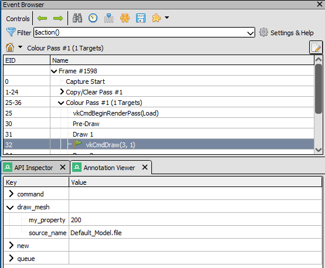
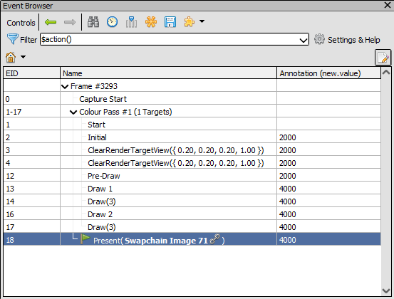
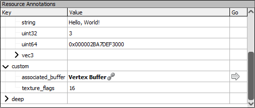
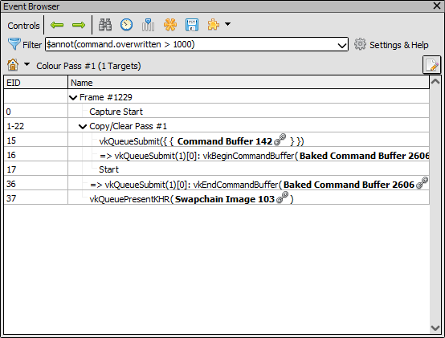

Annotation Viewer
=================

The annotation viewer window provides information on the per-command annotations provided by the application. By default it is hidden, if loading a capture with annotations included the viewer will be shown if it has never previously been used.

This page describes both the general annotation system as well as the specific viewer for per-command annotations. 

	Annotation Viewer: Showing the custom annotations on a selected event.

Individual annotations can be strings, scalar values (integers, floats, bools), up to 4-wide vectors of those same types, as well as other API objects.

Annotations are set in an arbitrary user-specified hierarchy as determined by a dot-separated path. When displayed, paths are sorted with a natural sort so arrays can be created by using paths such as ``custom.list.0``, ``custom.list.1``, and so on.

.. note::

  It is also possible to associate the same annotations with an object itself which can be viewed in a section in the :doc:`resource_inspector`.

Viewing command annotations
---------------------------

When opening a capture with annotations, if it hasn't been displayed before the Annotation Viewer will open and by default be docked onto the :doc:`api_inspector`. If you have closed the Annotation Viewer you will have to open it from the :guilabel:`Window` menu.

The Annotation Viewer will then show the set of annotations for the current event. These can be expanded and examined at will, and as different events are selected the annotations for each of those events will be shown.

When right clicking on an annotation, it can be selected for previewing in a column in the event browser. This is only possible for scalar values, but if a particular path is selected then a new column will be shown on the event browser that shows the value of that annotation (or nothing, if it is absent) at each event.

	Event Browser: Showing a given annotation as a column on each event.

Viewing object annotations
--------------------------

Annotations set on objects rather than commands are visible via the :doc:`resource_inspector`, when a capture contains annotations a panel will be shown with any annotations for the selected resource.

As different resources are selected, the same set of annotations will be displayed if there is overlap, so for example viewing a nested entry ``custom.nested.value`` it will stay expanded if a different resource is selected which also has that annotation.

The display is the same as for command annotations above in the Annotation Viewer.

	Resource Inspector: Viewing the annotations applied to an image in the resource inspector.

API usage
-------------------

The annotations are provided via the :doc:`../in_application_api` as the :cpp:func:`SetObjectAnnotation` and :cpp:func:`SetCommandAnnotation` functions, the documentation page for which provides the specific API reference. 

These can be wrapped in helper functions as desired to make it easier to integrate with an application's codebase.

.. tip::
   To explicitly remove annotations, you can set a value with ``valueType`` equal to ``eRENDERDOC_Empty`` and ``value`` equal to ``NULL``. This will delete the annotation at that path and all children.

Annotations can be set on objects at any time. The latest contents of these annotations are saved when the capture ends and do not vary depending on the current event. This means that any modifications to object annotations during a capture will be shown, but selecting different events will not change the annotations on an object. If you need annotations that vary by event, you can use command annotations.

Annotations on commands begin empty at the start of a capture, and are stored per-event with each event able to have a unique set of annotations.

Vulkan and D3D12 have both queue-level and command buffer-level annotations, OpenGL and D3D11 only having one immediate level of annotations. When dealing with both queue and command buffer annotations, the queue annotations persist globally on each queue, and command buffer annotations are layered on top for the duration of that command buffer.

Examples
^^^^^^^^

As a simple example of adding an annotation to an object on D3D11, assuming an ``rdoc`` pointer to the 1.7 API function structure:

.. highlight:: c++
.. code:: c++

  void AnnotateImage(ID3D11Device *dev, ID3D11Texture2D *tex, ID3D11Buffer *buf)
  {
    // using the RDAnnotationHelper to minimise typing for simple scalar values
    rdoc->SetObjectAnnotation(dev, tex, "custom.texture_flags", eRENDERDOC_Int32, 0, RDAnnotationHelper(16));

    // referring to an object, using the temporary value structure
    RENDERDOC_AnnotationValue val;
    val.apiObject = (void *)buf;
    rdoc->SetObjectAnnotation(dev, tex, "custom.associated_buffer", eRENDERDOC_APIObject, 0, &val);
  }

And similarly an example of adding a command annotation on Vulkan:

.. highlight:: c++
.. code:: c++

  void AnnotateCommand(VkInstance inst, VkCommandBuffer cmd)
  {
    void *dev = RENDERDOC_DEVICEPOINTER_FROM_VKINSTANCE(inst);
    rdoc->SetCommandAnnotation(dev, cmd, "draw_mesh.my_property", eRENDERDOC_Int32, 0,
                               RDAnnotationHelper(200));
                               
    rdoc->SetCommandAnnotation(dev, cmd, "draw_mesh.source_name", eRENDERDOC_String, 0,
                               RDAnnotationHelper("Default_Model.file"));
  }

Special object properties
-------------------------

When specifying an object, certain properties can be provided for convenience of display. With a buffer resource you can specify both ``resource`` as the API object, as well as ``resource.__offset`` and ``resource.__size`` to specify a particular sub-range of that buffer. When opening the resource from the annotation viewer or resource inspector the buffer viewer will pre-fill this particular range.

You can also specify ``resource.__rd__format`` as a string to provide a text-based buffer format to pre-fill in the buffer viewer, for more information see :doc:`../how/how_buffer_format`. You can also specify a ``__rd_format`` annotation on an object itself as well to provide a 'default' format.

.. note::

	These properties and any other properties prefixed with ``__`` will not be visible normally, and will only come into effect when applied in these ways.

Event filtering
---------------

The event browser filtering system also has a function for filtering based on annotations ``$annot()``.

This function can be used to filter the visible events, based on their annotation values. For example an expression like ``$annot(foo.bar > 5)`` will only display events where the annotation ``foo.bar`` is present, and stores a number greater than 5. Expressions can also filter based on strings using ``$annot(foo.bar contains "qux")`` or regular expression matching such as ``$annot(foo.bar =~ /qu[xz])``.

	Event Browser: Filtering the visible events based on an annotation.

Python access
-------------

Annotations on commands can be accessed via :py:attr:`renderdoc.APIEvent.annotations`, which is an optional :py:class:`~renderdoc.SDObject` object that can be accessed recursively. Helper functions like :py:meth:`~renderdoc.SDObject.FindChildByKeyPath` can be used to speed up accessing a specific annotation.

Annotations on objects are available in a similar way through :py:attr:`renderdoc.ResourceDescription.annotations`.